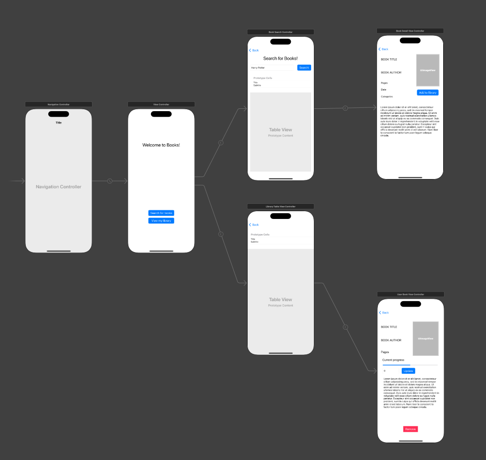
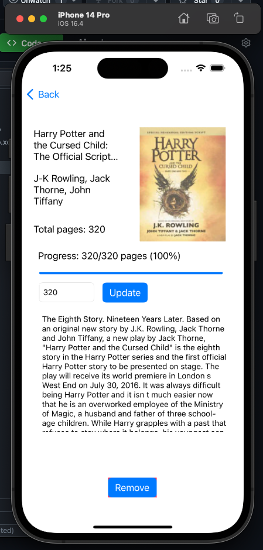

# ITE-5334 IOS Final Project - Books app

**Student:** James Chard - N01685334

This is a simple personal reading companion app to search for books from the google books API, save them to their library, and track reading progress.

User library data is persisted in Core Data.

